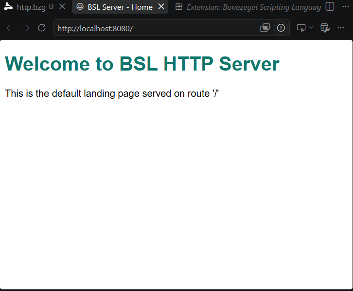
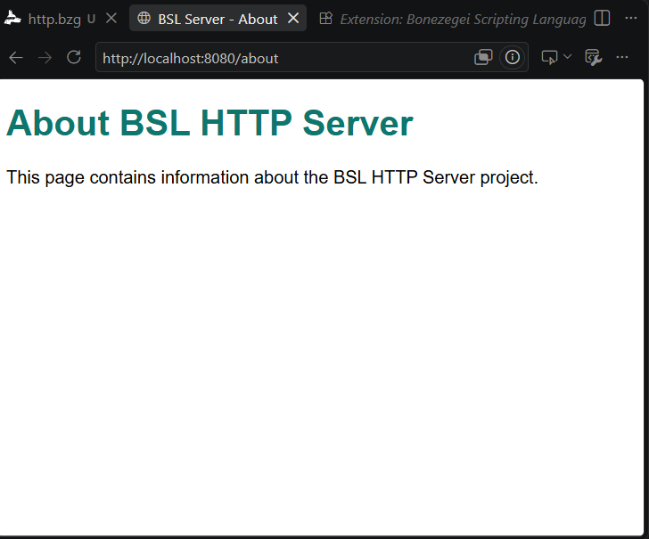
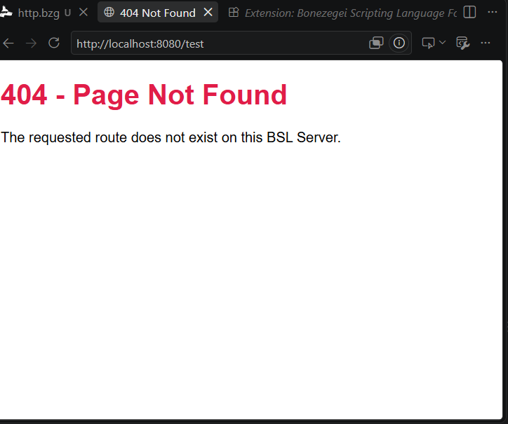
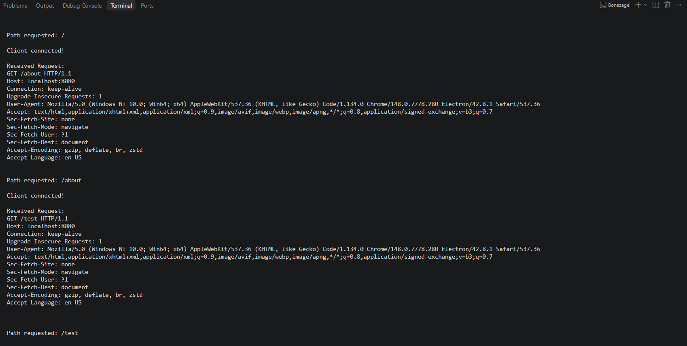

# ITN183-LAB1

# BSL HTTP Server

## 1. Project Description

This project is a simple HTTP web server made from scratch using **Bonezegei Scripting Language (BSL)** and the **BSL Socket Library**.

Instead of using a web framework, the server works directly with **TCP sockets**. It receives the browser's HTTP request, gets the requested path, and sends back an HTML response.

The server runs on **port 8080** and has three basic routes:

* `/` – Home page
* `/about` – About page
* Any other path – 404 Not Found page

This project was created for **ITE 153** as a way to practice socket programming and understand how HTTP works behind the scenes.

---

## 2. Installation & Setup

### Requirements

* Bonezegei Scripting Language
* Visual Studio Code
* BSL Formatter extension

You can install BSL from the Microsoft Store or use the installer for your operating system.

### Install the Socket Library

Open a terminal in the project folder and run:

```bash
bzg install socket
```

### Run the Server

Run the following command:

```bash
bonezegei src/http.bzg
```

If everything is working, you should see:

```text
Socket Ready
Server running on http://localhost:8080/
```

---

## 3. Usage

Once the server is running, open your browser and visit:

**Home**

```text
http://localhost:8080/
```

**About**

```text
http://localhost:8080/about
```

**404 Page**

```text
http://localhost:8080/anything
```

Any route other than `/` and `/about` will show the custom 404 page.

The server also prints incoming connections and HTTP requests in the terminal, so you can see what the browser is sending to the server.

---

## 4. How It Works

The server reads the browser's HTTP request directly from the socket.

It then uses `regex()` and `substr()` to get the requested path, such as `/` or `/about`.

The path is checked against the available routes:

* If the path is `/`, the home page is returned.
* If the path is `/about`, the about page is returned.
* If the path doesn't match either one, a 404 page is returned.

I used `regex()` and `substr()` instead of methods like `.indexOf()` because the data returned by `socket_read()` is handled as a raw string/buffer type in the BSL Socket Library.

---

## 5. Technologies Used

* **Bonezegei Scripting Language (BSL)**
* **BSL Socket Library**
* **TCP Sockets**
* **HTTP**
* **HTML**

## 6. Project Status

**Completed** – Created for ITE 153 coursework.

## 5. Screenshots
### Home Route (/)


### About Route (/about)


### 404 Not Found Page


### Terminal Output
